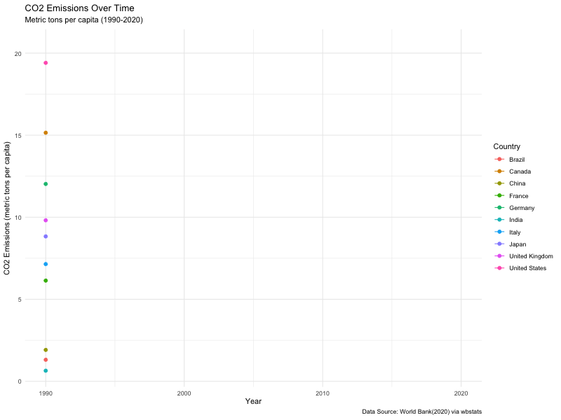

# Animated CO2 Emissions Over Time

## Description
This project visualises CO2 emissions per capita across multiple countries from 1990 to 2020 using R. The animation helps to track and compare how different countries have contributed to global CO2 emissions over time. The project uses data from the World Bank, and it aims to give insights into environmental changes.



## Programs and Libraries Used
- **R (with RStudio)**
- **R Libraries:**
  - `ggplot2` Creating the baseline plots.
  - `gganimate` Animates the plots 
  - `wbstats` Retrieves CO2 emissions data directly from the World Bank.
  - `dplyr` data manipulation and wrangling.
  - `gifski` Renders the animation as a GIF.
  - `tidyverse` A collection of R packages for data science. (not essential for this project but handy)

## Data Sources
The data used in this project is sourced from the World Bank via the `wbstats` package. But you can also access the data manually [here](https://data.worldbank.org/).

## Installation
1. **Install R:** Make sure you have R installed. You can download it from [CRAN](https://cran.r-project.org/).
2. **Install RStudio:** (Optional but recommended) Download [RStudio](https://rstudio.com/products/rstudio/download/) 
3. **Install the required R packages:**
   ```
   install.packages(c("ggplot2", "gganimate", "wbstats", "dplyr", "gifski", "tidyverse"))
   ```

## How to use
- Customise the data
  - **Countries:** Modify the countries vector to change the countries displayed in the animation.
   ```
    countries <- c("USA", "CHN", "DEU", "JPN", "IND", "GBR", "FRA", "BRA", "ITA", "CAN")
   ```
  - **Years:** Edit the start_date and end_date in the wb_data function to look at a different time period.
   ```
   data <- wb_data(indicator = "EN.ATM.CO2E.PC", start_date = 1990, end_date = 2020)
   ```
  - **Indicators:** Change the indicator parameter in the wb_data function to analyse different environmental/economic indicators from the World Bank.
   ```
   data <- wb_data(indicator = "NY.GDP.PCAP.CD", start_date = 1990, end_date = 2020)  # Example for GDP per capita`
   ```

## License
This project is licensed under the MIT License - see the [LICENSE](LICENSE) file for details.

## Contact
Any feedback is welcome and encouraged!
- **GitHub:** @ariyoamy
